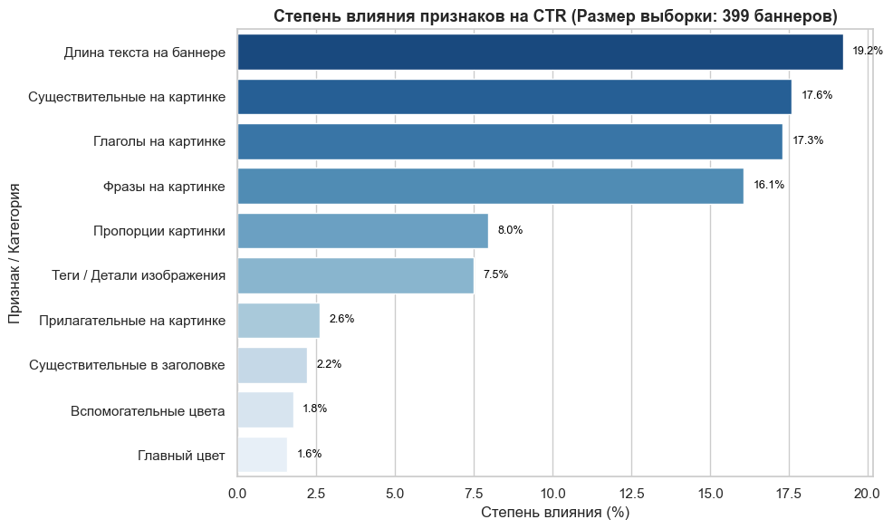
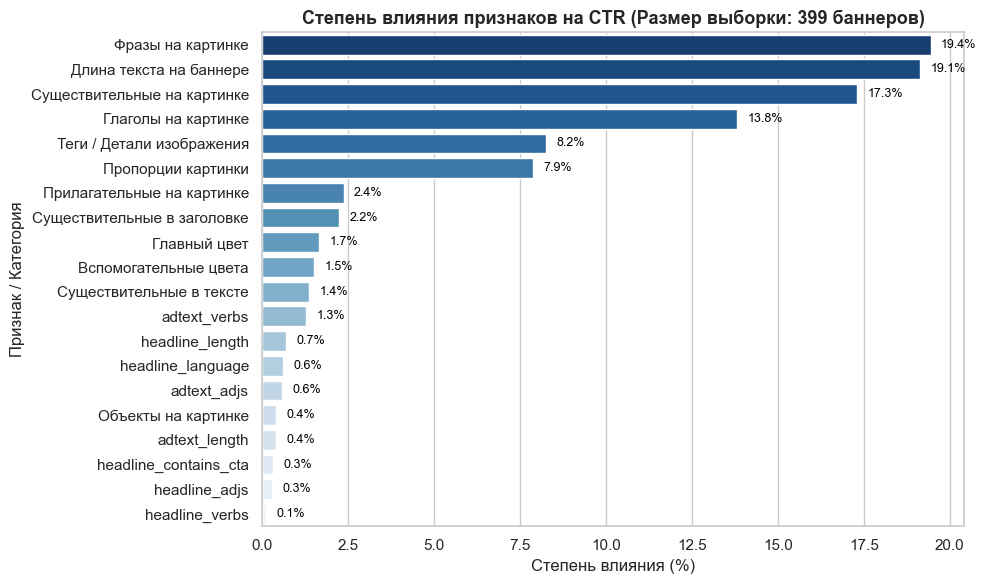

# ML-анализ эффективности креативов: Гайдлайны для маркетинга и дизайна

Данный анализ проведен для того, чтобы связать язык данных с практикой создания рекламных материалов. На основе моделей машинного обучения (Machine Learning) исследование переводит абстрактные метрики в понятные, применимые рекомендации для дизайнеров и маркетологов.

**Цель** — отказаться от интуитивного производства креативов и сформировать data-driven гайдлайны: оцифровать влияние отдельных элементов (визуальных акцентов, текстов, форматов, цветовых решений) на ключевые показатели эффективности (CTR, CR).

## Структура работы
Исследование разделено на два Jupyter Notebook в зависимости от бизнес-задачи и роли читателя:

* `creative_efficiency.ipynb` (общий анализ и готовые рекомендации)
  - Фокус: Практическая польза для маркетинга и дизайна, верхоуровневые тренды.
  - Содержание: Полный pipeline машинного обучения (предобработка, Feature Engineering, NLP-извлечение тегов из текстов/заголовков, расчет Feature Importance для всех 20+ признаков).
  - Для кого: Маркетологи, арт-директоры, дизайнеры, Product-менеджеры.

  

  
🔍 <b>Нажмите, чтобы посмотреть полный спектр факторов (Общий график)</b>

   

  

  
   
  <i>Рисунок 1: Ключевые факторы, оказывающие наибольшее влияние на CTR (агрегированный анализ)</i>
  

  

* `creative_efficiency_detail.ipynb` (детальный ML-анализ и математическая база)
  - Фокус: Глубокая аналитика, полный спектр гипотез и математическая база.
  - Содержание: Полный pipeline машинного обучения (предобработка, Feature Engineering, обучение моделей, например RandomForestRegressor / XGBoost), расчет важности признаков (Feature Importance / Permutation Importance) и визуализация результатов.
  - Для кого: Маркетологи, арт-директоры, дизайнеры, Product-менеджеры.

  

  
🔍 <b>Нажмите, чтобы посмотреть полный спектр факторов (Детальный график)</b>

   

  

  
   
  <i>Рисунок 2: Полная структура важности признаков, включая NLP-метрики заголовков и текстов</i>
  

  

## Бизнес-ценность проекта
* Для дизайнеров: Четкое понимание, какие именно визуальные атрибуты и компоновки генерируют отклик аудитории, а какие перегружают макет.
* Для маркетологов: Оптимизация бюджета на производство контента за счет фокуса на элементах с наибольшим ROI.
* Для команды: Сокращение цикла согласования креативов на основе аргументированных данных, а не субъективных оценок.

## Стек технологий
* Машинное обучение и анализ: Scikit-learn (моделирование, Feature Importance, preprocessing)
* Обработка данных: Pandas, NumPy
* Визуализация: Plotly, Matplotlib, Seaborn

## Ключевые выводы для команды (Пример заполнения)
На основе проанализированных данных с помощью ML-модели выявлено:

1. **Текст на самом изображении — главный драйвер CTR:**
   * Длина текста на баннере (~19.2%) и ключевые фразы (~16.1%) суммарно дают более 35% успеха.
2. **Визуально-текстовые смыслы важны:**
   * Наличие существительных (17.6%) и глаголов (17.3%) на графике критично для удержания внимания.
3. **Цветовая гамма вторична:**
   * Главный и вспомогательные цвета баннера суммарно оказывают менее 3.5% влияния на кликабельность.
